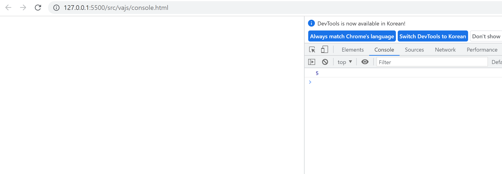

## 변수선언 형식

변수명은 문자(특수문자 제외), 숫자, _(언더스코어), $(달러기호)를 포함하여 만들 수 있다.
변수명은 숫자로 시작 할수 없다.
자바스크립트 예약어는 사용할 수 없다.
변수명은 대소문자를 구분한다.


## X = 5 다 console.log 찍어보기
```
<!DOCTYPE html>
<html>
  <head>
    <title>Document</title>
  </head>
  <body>
    <script>
      const x = 5; //변수 x에 5을 저장
    console.log (x);
    </script>
  </body>
</html>
```
## 결과 표시 그림

