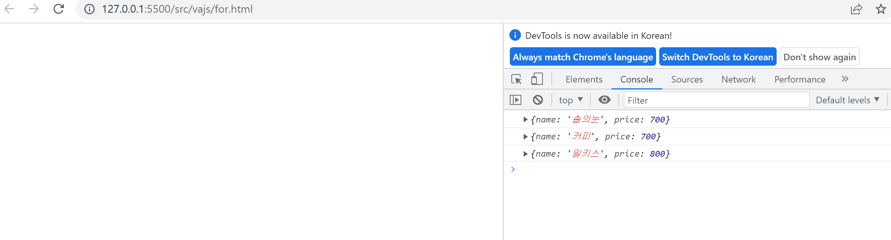

## 바닐라자바스크립트 반복문 for-loop, for-of, while

## for (1)
```
<!DOCTYPE html>
<html>
  <head>
    <title>Document</title>
  </head>
  <body>
    <script>
      let brands = ["김씨", "박씨" , "상씨", "개씨", "돌씨"];
    console.log (brands);

    for (let i = 0; i < brands.length; i++) {
        console.log(brands[i]);
        
    }
    </script>
  </body>
</html>

```

## for 예제 (2)
```
<!DOCTYPE html>
<html>
  <head>
    <title>Document</title>
  </head>
  <body>
    <script>
        
    var productList = [
    // 음료 리스트
    {
      name: "솔의눈",
      price: 700,
    },
    {
      name: "커피",
      price: 700,
    },
    {
      name: "파워레이드",
      price: 1200,
    },
    {
      name: "오렌지",
      price: 1000,
    },
    {
      name: "보리차",
      price: 1200,
    },
    {
      name: "밀키스",
      price: 800,
    },
  ];

  let inputCoin = 800;           //고객이 음료 구매를 위한 투입한 총 금액
  let len = productList.length;  //배열 productList에 담긴 요소의 길이
  let outputList = [];           //고객이 구매할 수 있는 음료 목록을 저장할 새로운 배열
  for (var i = 0; i < len; i++) {
                                 //productList의 모든 요소에 대한 접근
    if (productList[i].price <= inputCoin) {
                                 //음료 가격이 고객이 투입한 금액 보다 같거나 작으면
      outputList.push(productList[i]); //outputList에 추가
      console.log(productList[i]);
    }
  }
</script>

  </body>
</html>
```
## 결과 표시 그림

